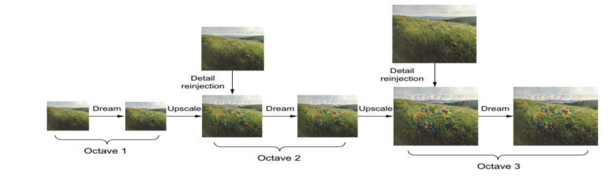
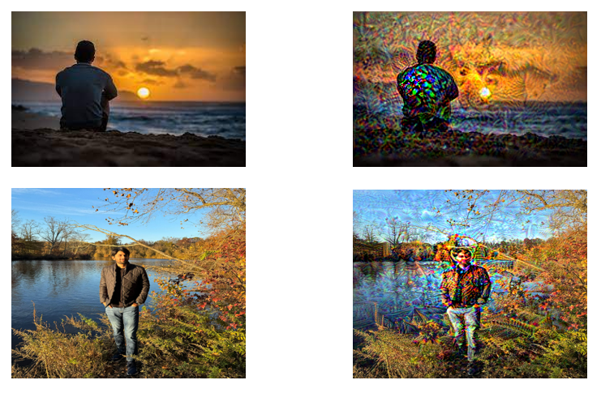
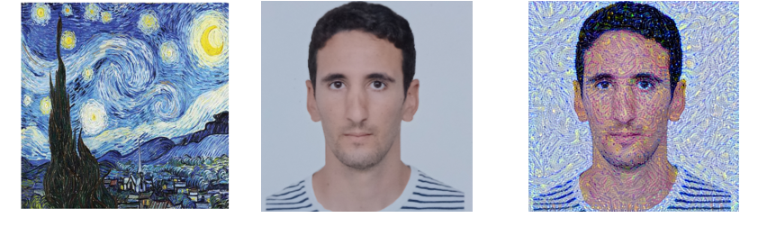
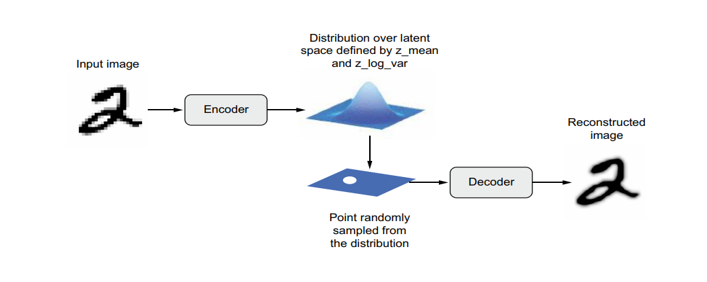
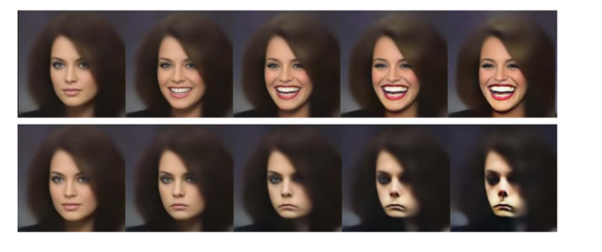
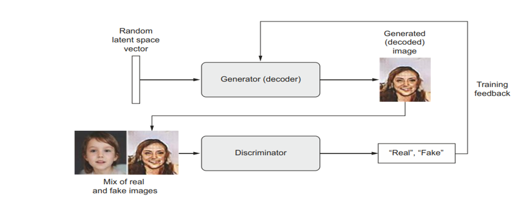
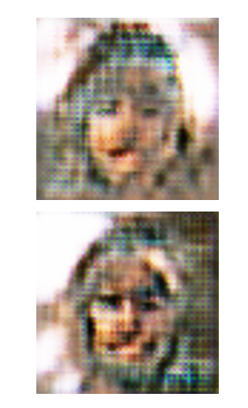

# computer-vesion---processing-and-generation
## Deep Dream
DeepDream consists of running a convnet in reverse to generate inputs based on the representations learned by the network.
We try to maximize the activation of entire layers rather than that of a specific filter, thus mixing together visualizations of large numbers of features at once.
The input images are processed at different scales (called octaves), which improves the quality of the visualizations.

## Style Transfer
Neural style transfer consists of applying the style of a reference image to a target image while conserving the content of the target image
style essentially means textures, colors, and visual patterns in the image, at various spatial scales, and the content is the higher-level macrostructure of the image

 Content can be captured by the high-level activations of a convnet. 
 Style can be captured by the internal correlations of the activations of different layers of a convnet.

## VAEs
Image generation with deep learning is done by learning latent spaces that capture statistical information about a dataset of images. By sampling and decoding points from the latent space, you can generate never-before-seen images.

VAEs result in highly structured, continuous latent representations. For this reason, they work well for doing all sorts of image editing in latent space: face swapping, turning a frowning face into a smiling face, and so on.
 They also work nicely for doing latent-space-based animations, such as animating a walk along a cross section of the latent space or showing a starting image slowly morphing into different images in a continuous way.

## GANs
Normally, gradient descent consists of rolling down hills in a static loss landscape. But with a GAN, every step taken down the hill changes the entire landscape a little. It’s a dynamic system where the optimization process is seeking not a minimum, but an equilibrium between two forces.

We use strides instead of pooling for downsampling feature maps in the discriminator.
We sample points from the latent space using a normal distribution. 
Two things can induce gradient sparsity: Instead of max pooling, we used strided convolutions for downsampling, and we used a LeakyReLU layer instead of a relu activation.
We use a kernel size that’s divisible by the stride size whenever we use a strided Conv2DTranspose or Conv2D. To go around checkerboard artifacts caused by unequal coverage of the pixel space in the generator 

